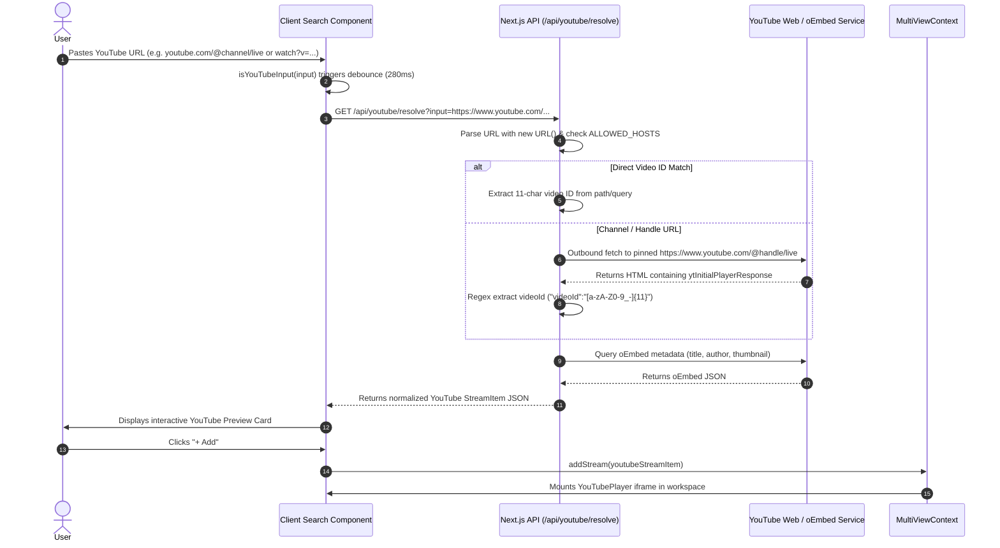

# StreamView - Application Flow & State Architecture

## 1. Overview & Core Routing
StreamView is an adaptive multi-view streaming workspace engineered for Next.js 14 App Router. It allows users to discover, aggregate, and simultaneously watch live streams from Kick.com alongside live YouTube broadcasts.

The application contains four primary route surfaces:
- `/` (Home & Discovery): Live stream discovery, search, community hashtag filters, and featured streams.
- `/multi-view` (Interactive Cockpit): Dynamic multi-stream player supporting up to 6 simultaneous streams in Equal Grid or Stage View.
- `/how-it-works`: Technical breakdown of the crawler, stream filtering, and architecture.
- `/terms` & `/privacy`: Legal, third-party embed disclaimers, and user privacy guarantees.

---

## 2. End-to-End User Journeys

```mermaid
flowchart TD
    Start([User Visits StreamView]) --> HomeCheck{Route Entered}
    
    HomeCheck -->|Landing Page /| HomePage[Landing Page: Search & Discovery]
    HomeCheck -->|Direct Link /multi-view| MVWorkspace[Multi View Workspace]
    
    HomePage --> SearchAction[User Searches or Clicks Trending Tag]
    HomePage --> ClickStream[User Clicks '+ Add' on Stream Card]
    HomePage --> LaunchWorkspace[User Clicks 'Launch Multi View']
    
    ClickStream --> AddToContext[Add Stream to MultiViewContext]
    LaunchWorkspace --> NavigateMV[Navigate to /multi-view]
    AddToContext --> NavigateMV
    
    NavigateMV --> MVWorkspace
    
    MVWorkspace --> CheckStreams{Streams in State?}
    CheckStreams -->|No (0 streams)| EmptyState[Empty State View]
    CheckStreams -->|Yes (1-6 streams)| ActiveGrid[Active Multi-View Stage / Grid]
    
    EmptyState --> EmptySearch[Search Kick Channel or Paste YouTube URL]
    EmptySearch --> AddFromEmpty[Add Selected Stream]
    AddFromEmpty --> ActiveGrid
    
    ActiveGrid --> UserControls[User Layout & Stream Controls]
    UserControls --> SwitchLayout[Toggle Equal Grid <-> Stage View]
    UserControls --> SoloAudio[Click Solo Audio on Player]
    UserControls --> SwapStage[Swap Stream to Center Stage]
    UserControls --> AddMoreStreams[Search & Add up to 6 Streams]
    UserControls --> ShareURL[Click Share to Copy Parametrized Link]
```

---

## 3. Stream Ingestion & YouTube Resolution Flow



---

## 4. Multi-View Layout & State Management

The client state is governed by `MultiViewContext` in `components/multiview/multiview-context.jsx`:

### Context State Model
```typescript
interface MultiViewState {
  streams: StreamItem[];           // Current active streams (max 6)
  layoutMode: "equal" | "stage";   // Grid layout algorithm
  stageIndex: number;              // Index of the primary focus stream
  syncAudio: boolean;              // Audio sync toggle
  audioFocusedId: string | null;   // Currently unmuted stream ID
  recentSearches: string[];        // Persisted in localStorage (max 50)
  pinnedChannels: string[];        // Persisted in localStorage (max 50)
}
```

### Layout Modes
1. **Equal Grid (`equal`)**:
   - 1 stream: 100% viewport width/height.
   - 2 streams: 1x2 split (50% / 50%).
   - 3 streams: 1 top large stream + 2 bottom streams or 3-column split.
   - 4 streams: 2x2 symmetrical matrix.
   - 5-6 streams: 3x2 responsive grid.
2. **Stage View (`stage`)**:
   - 1 Primary Stream occupies 75% of the viewport.
   - Secondary Streams line up in a horizontal ribbon or side vertical column.
   - Clicking "Promote to Stage" swaps any secondary stream with the primary stream instantly with zero reload.

---

## 5. URL Sharing & Deep Linking Architecture
When streams are modified, `MultiViewWorkspace` serializes the active channels into shareable query parameters:
- Kick channels: `?channels=hathoda,qayzer4`
- YouTube streams: `&yt=dQw4w9WgXcQ,M7lc1UVf-VE`

On initial page load, `multiview-context.jsx` reads the search params, hydrates Kick metadata via `/api/kick/channel` and YouTube metadata via `/api/youtube/resolve`, and reconstructs the user's workspace automatically.
